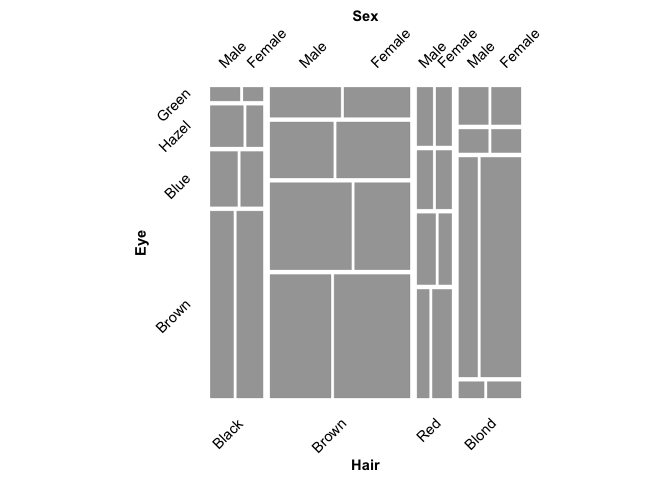
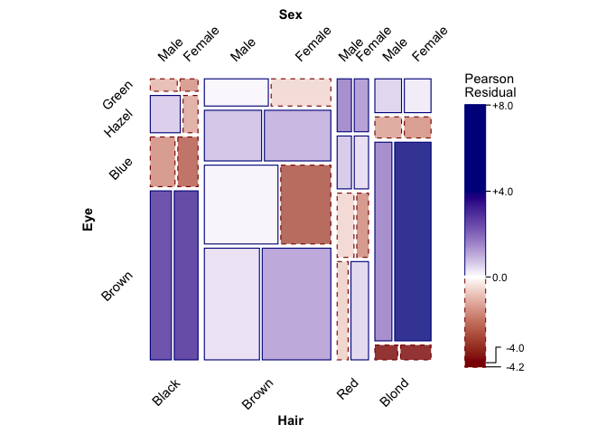
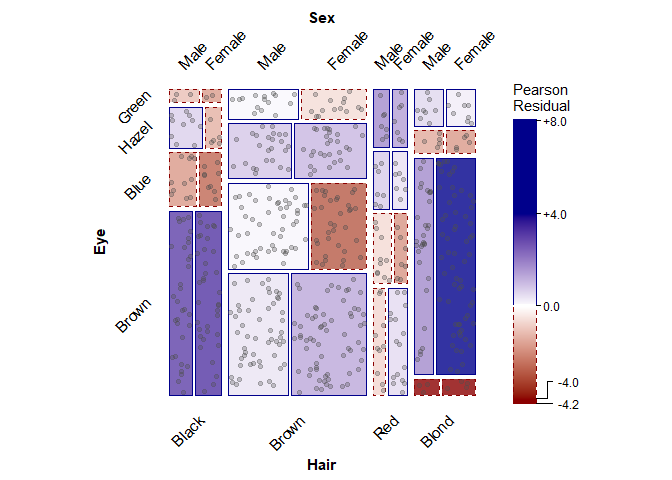

<!-- README.md is generated from README.Rmd. Please edit that file -->
<!-- badges: start -->

[](https://CRAN.R-project.org/package=ggmosaic2)
[](https://friendly.r-universe.dev)
[](https://github.com/friendly/ggmosaic2/)
[](https://friendly.github.io/ggmosaic2/)
[](https://github.com/friendly/ggmosaic2/actions/workflows/R-CMD-check.yaml)
<!-- badges: end -->

# ggmosaic2 

*Version 0.5.1, built 2026-08-12*

`ggmosaic2` is a standalone continuation of the `ggmosaic` package,
which was removed from CRAN around November 2025 and appeared
unmaintained (a [pull
request](https://github.com/haleyjeppson/ggmosaic/pull/86) adding
residual-based shading went unanswered). Rather than fork under the
original name, `ggmosaic2` is developed independently, building on
`ggmosaic`’s original authors (Haley Jeppson, Heike Hofmann, Di Cook;
credited as authors in `DESCRIPTION`). `ggmosaic` was designed to create
visualizations of categorical data and is capable of producing bar
charts, stacked bar charts, mosaic plots, and double decker plots.

`ggmosaic2` extends this with jittered-point overlays showing individual
observations (reflecting non-independence as variation in point density,
a physical analog for departures from independence), residual-based
shading, and support for fitted loglinear models to show patterns of
association among variables in frequency tables.

## Installation

You can install `ggmosaic2` from GitHub with:

``` r
# install.packages("devtools")
devtools::install_github("friendly/ggmosaic2")
```

## Example

The `datasets::HairEyeColor` is a classic example of what can be learned
from a mosaic plot. It is a 3-way table, containing the frequencies of
592 students who were asked to give their hair color and eye color,
classified by `Sex`

``` r
ftable(Hair ~ Eye + Sex, data=HairEyeColor)
#>              Hair Black Brown Red Blond
#> Eye   Sex                              
#> Brown Male           32    53  10     3
#>       Female         36    66  16     4
#> Blue  Male           11    50  10    30
#>       Female          9    34   7    64
#> Hazel Male           10    25   7     5
#>       Female          5    29   7     5
#> Green Male            3    15   7     8
#>       Female          2    14   7     8
```

To provide some context, the main questions here are:

- Are hair and eye color associated in this sample?
- If so, what is the nature/pattern of association?
- Is this the same for males and females?

See: REFS-HERE for more.. Here, we just illustrate how to display this
dataset using `ggmosaic2`.

### Basic mosaic plot

With default shading, a mosaic plot just shows the relative frequencies
of each combination of `Sex`, `Eye`, and `Hair`, via the area of each
tile. To accommodate the alternate splitting in horizontal and vertical
directions, `geom_mosaic()` uses a `product()` to specify the
geometrical aesthetic of the plot.

``` r
library(ggmosaic2)

HairEyeColor |>
  as.data.frame() |>
  ggplot() +
  geom_mosaic(aes(x = product(Sex, Eye, Hair), weight = Freq)) +
  theme_mosaic(rot_labels = 45)
```



### Residual-shaded mosaic plot

To see whether hair and eye color are associated, fit a loglinear model
of independence (`expected = "independence"`) and shade each tile by its
residual from that model with `scale_fill_residual()`. Tiles shaded blue
occur more often than expected under independence; tiles shaded red
occur less often.

``` r
HairEyeColor |>
  as.data.frame() |>
  ggplot() +
  geom_mosaic(aes(x = product(Sex, Eye, Hair), weight = Freq),
              expected = "independence") +
  scale_fill_residual(limits = c(-4, 4)) +
  theme_mosaic(rot_labels = 45)
```



### Jittered points: showing individual observations

`geom_mosaic_jitter()` overlays one jittered point per individual
observation on top of a mosaic plot, so that non-independence shows up
both as residual shading and as variation in point density within each
tile. It needs one row per observation, so first expand `HairEyeColor`
from its frequency-table form using `tidyr::uncount()`.

``` r
HairEyeColor |>
  as.data.frame() |>
  tidyr::uncount(Freq) |>
  ggplot() +
  geom_mosaic(aes(x = product(Sex, Eye, Hair)), expected = "independence") +
  scale_fill_residual(limits = c(-4, 4)) +
  geom_mosaic_jitter(aes(x = product(Sex, Eye, Hair)), alpha = 0.3) +
  theme_mosaic(rot_labels = 45)
```



## geom_mosaic: setting the aesthetics

In `geom_mosaic()`, the following aesthetics can be specified:

- `weight`: select a weighting variable. This is useful when your data
  is in frequency form, consisting of a dataset of factor variables and
  a variable (`count` or `Freq`) giving the frequency in each cell of an
  n-way table.

- `x`: select variables to add to formula

  - declared as `x = product(var2, var1, ...)`

- `alpha`: add an alpha transparency to the selected variable

  - unless the variable is called in `x`, it will be added to the
    formula in the first position

- `fill`: select a variable to be filled

  - unless the variable is called in `x`, it will be added to the
    formula in the first position after the optional `alpha` variable.

- `conds` : select a variable to condition on

  - declared as `conds = product(cond1, cond2, ...)`

These values are then sent through repurposed `productplots` functions
to create the desired formula: `weight ~ alpha + fill + x | conds`.

<!--
This section deleted as no longer useful.
&#10;## Version compatibility issues with ggplot2
&#10;Since the initial release of ggmosaic, ggplot2 has evolved considerably. And as ggplot2 continues to evolve, ggmosaic must continue to evolve alongside it. Although these changes affect the underlying code and not the general usage of ggmosaic, the general user may need to be aware of compatibility issues that can arise between versions. The table below summarizes the compatibility between versions (inherited history from `ggmosaic`, prior to the `ggmosaic2` fork).
&#10;
| ggmosaic | ggplot2 | Axis labels                                                                   | Tick marks    |
|----------|---------|-------------------------------------------------------------------------------|---------------|
| [@93e5840](https://github.com/haleyjeppson/ggmosaic/commit/93e5840cc9586524428d36aeb8b33630341d20d7)    | 3.3.4   | x                                                                             | x     |
| 0.3.3    | 3.3.3   | x                                                                             | x             |
| 0.3.0    | 3.3.0   | x                                                                             | x             |
| 0.2.2    | 3.3.0   | Default labels are okay, but must use <br>`scale_*_productlist()` to modify | No tick marks |
| 0.2.2    | 3.2.0   | Default labels okay, but must use <br>`scale_*_productlist()` to modify     | x             |
| 0.2.0    | 3.2.0   | Default labels are wrong, but can use <br>`labs()` to modify                  | x             |
-->
