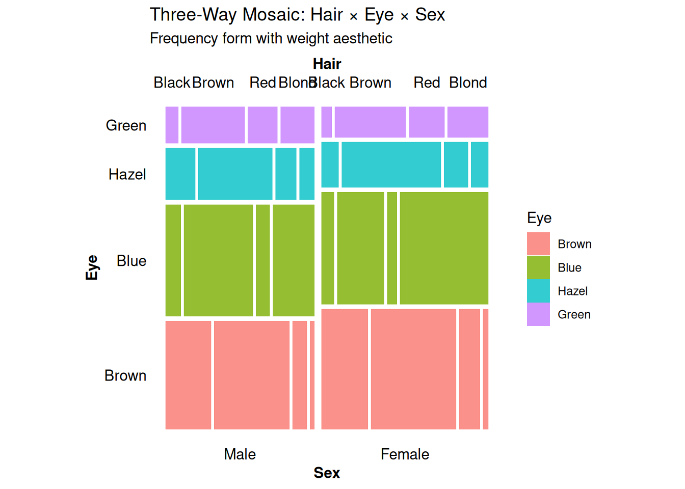
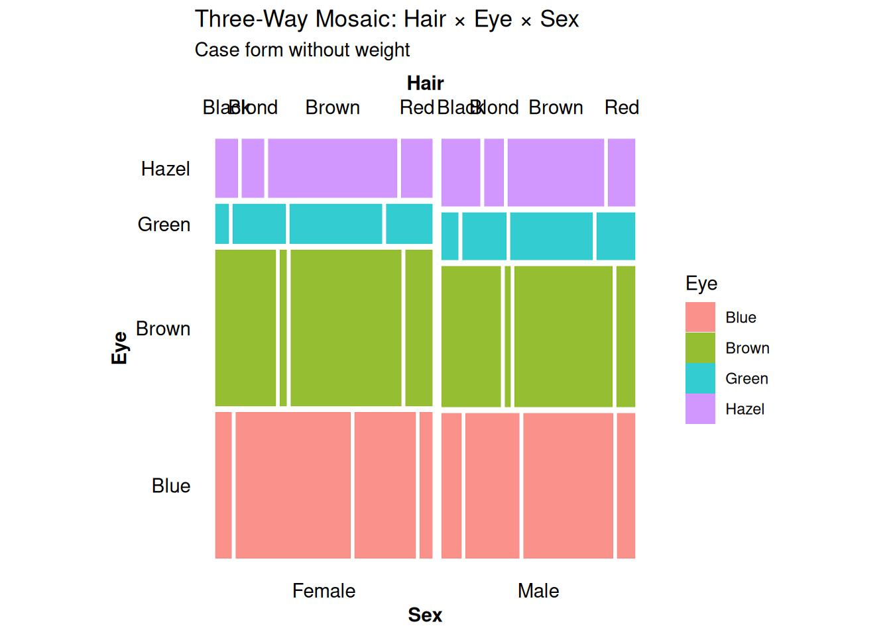
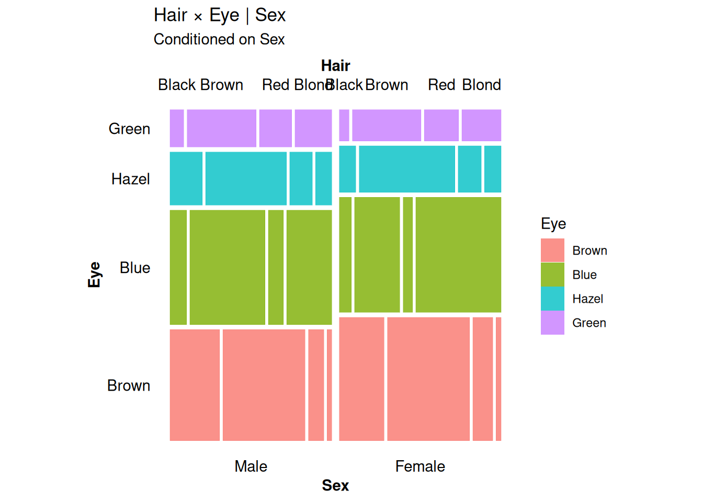
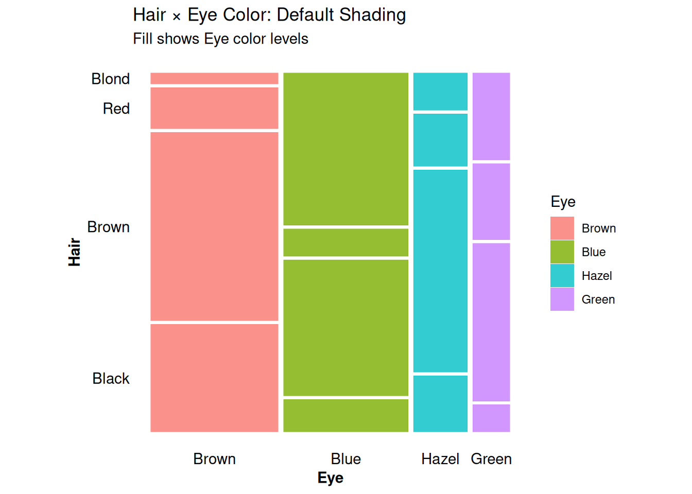
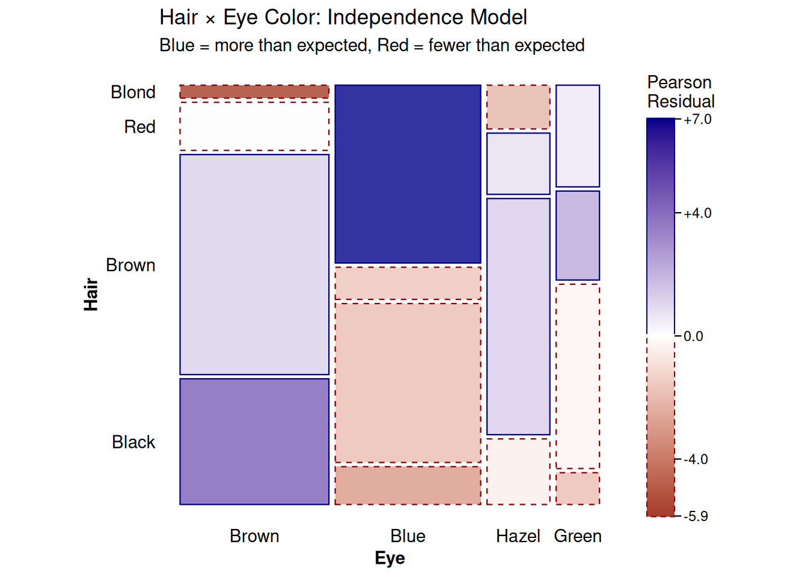
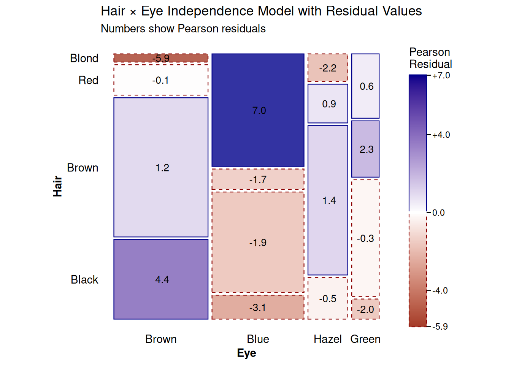
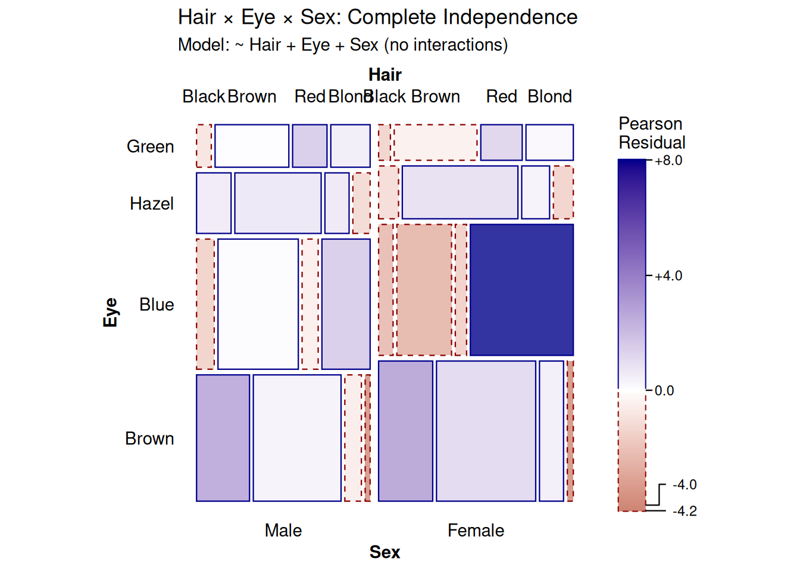
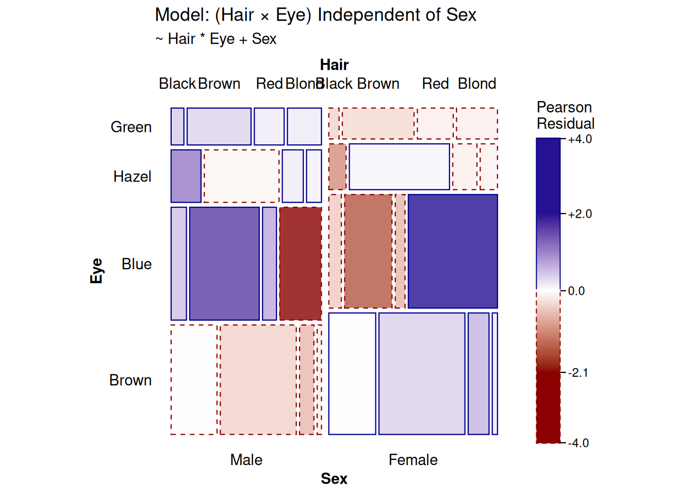
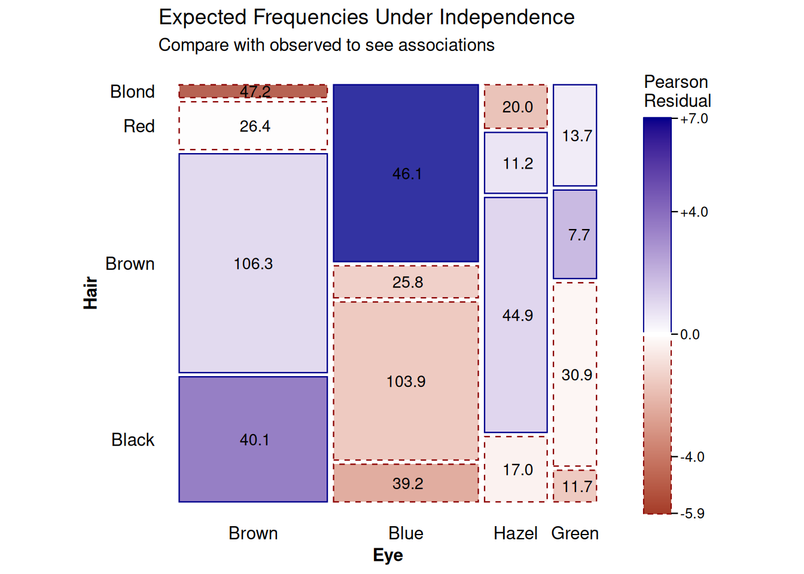
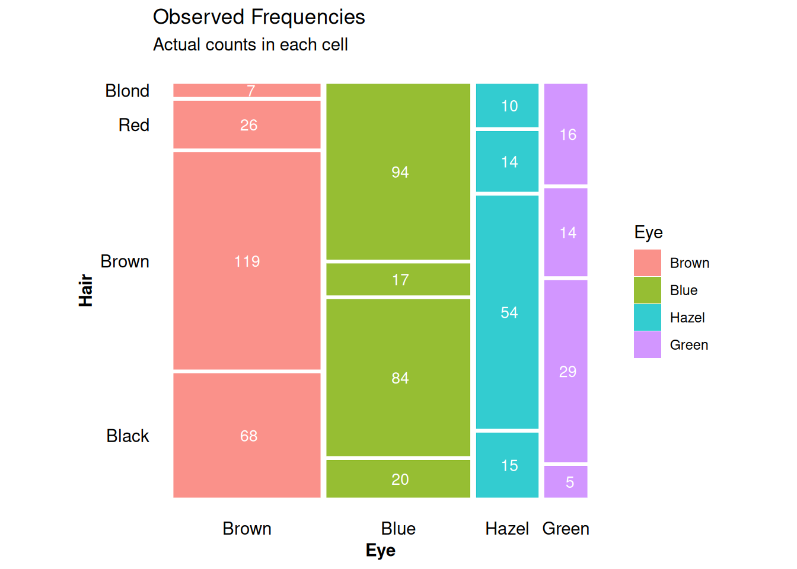

# Three Forms of Frequency Tables for Mosaic Displays

``` r

library(ggmosaic2)
library(vcdExtra)
library(dplyr)
```

## Introduction

Categorical data can be represented in three fundamentally different
forms, each with advantages for different purposes. Understanding these
forms and how to convert between them is essential for effective
visualization and analysis with mosaic plots. This vignette illustrates:

1.  **The three forms** of frequency tables (table form, frequency form,
    and case form)
2.  **Conversions** between these forms
3.  **Using
    [`geom_mosaic()`](https://friendly.github.io/ggmosaic2/reference/geom_mosaic.md)**
    with each form
4.  **Comparing** default shading vs. residual-based shading from
    loglinear models

We’ll use the classic `HairEyeColor` dataset throughout to demonstrate
these concepts with both two-way and three-way tables.

For a comprehensive treatment of these forms and conversions, see the
[vcdExtra
vignette](https://friendly.github.io/vcdExtra/articles/a1-creating.html)
by Friendly & Meyer (2016).

## The Three Forms

### Table Form

**Table form** represents categorical data as an array or table object
where: - Dimensions correspond to categorical variables - Elements
contain cell frequencies - Dimension names provide variable and level
information

This is the most compact representation and the natural output from
[`table()`](https://rdrr.io/r/base/table.html) and
[`xtabs()`](https://rdrr.io/r/stats/xtabs.html).

``` r

# HairEyeColor is already in table form
str(HairEyeColor)
#>  'table' num [1:4, 1:4, 1:2] 32 53 10 3 11 50 10 30 10 25 ...
#>  - attr(*, "dimnames")=List of 3
#>   ..$ Hair: chr [1:4] "Black" "Brown" "Red" "Blond"
#>   ..$ Eye : chr [1:4] "Brown" "Blue" "Hazel" "Green"
#>   ..$ Sex : chr [1:2] "Male" "Female"
class(HairEyeColor)
#> [1] "table"

# Examine the 3-way table structure
HairEyeColor
#> , , Sex = Male
#> 
#>        Eye
#> Hair    Brown Blue Hazel Green
#>   Black    32   11    10     3
#>   Brown    53   50    25    15
#>   Red      10   10     7     7
#>   Blond     3   30     5     8
#> 
#> , , Sex = Female
#> 
#>        Eye
#> Hair    Brown Blue Hazel Green
#>   Black    36    9     5     2
#>   Brown    66   34    29    14
#>   Red      16    7     7     7
#>   Blond     4   64     5     8

# Total observations
sum(HairEyeColor)
#> [1] 592
```

The `HairEyeColor` dataset is a 4 × 4 × 2 contingency table with 592
observations classified by hair color, eye color, and sex.

### Frequency Form

**Frequency form** is a data frame where: - Each row represents one cell
of the contingency table - Factor columns specify the cell’s
coordinates - A frequency column (typically `Freq`) contains the count
for that cell - Total observations = `sum(df$Freq)`

This form is convenient for modeling and is the output from
[`as.data.frame()`](https://rdrr.io/r/base/as.data.frame.html) applied
to tables.

``` r

# Convert table to frequency form
hair_freq <- as.data.frame(HairEyeColor)
head(hair_freq, 10)
#>     Hair   Eye  Sex Freq
#> 1  Black Brown Male   32
#> 2  Brown Brown Male   53
#> 3    Red Brown Male   10
#> 4  Blond Brown Male    3
#> 5  Black  Blue Male   11
#> 6  Brown  Blue Male   50
#> 7    Red  Blue Male   10
#> 8  Blond  Blue Male   30
#> 9  Black Hazel Male   10
#> 10 Brown Hazel Male   25
nrow(hair_freq)  # 32 cells in the 4 × 4 × 2 table
#> [1] 32

# Verify totals match
sum(hair_freq$Freq)
#> [1] 592
```

Frequency form is ideal for: - Input to modeling functions
([`glm()`](https://rdrr.io/r/stats/glm.html), `loglm()`, etc.) -
Filtering specific cells or combinations - Adding derived variables -
Use with `ggplot2` via the `weight` aesthetic

### Case Form

**Case form** represents data as: - Each row is one individual
observation - Factor columns contain the variable values for that
individual - No frequency column needed - Total observations =
`nrow(df)`

This is the “raw data” format and most intuitive for those familiar with
data collection.

``` r

# Convert frequency form to case form using vcdExtra::expand.dft()
hair_case <- expand.dft(hair_freq, freq = "Freq")
head(hair_case, 10)
#>     Hair   Eye  Sex
#> 1  Black Brown Male
#> 2  Black Brown Male
#> 3  Black Brown Male
#> 4  Black Brown Male
#> 5  Black Brown Male
#> 6  Black Brown Male
#> 7  Black Brown Male
#> 8  Black Brown Male
#> 9  Black Brown Male
#> 10 Black Brown Male
nrow(hair_case)  # 592 individual observations
#> [1] 592

# Structure
str(hair_case)
#> 'data.frame':    592 obs. of  3 variables:
#>  $ Hair: chr  "Black" "Black" "Black" "Black" ...
#>  $ Eye : chr  "Brown" "Brown" "Brown" "Brown" ...
#>  $ Sex : chr  "Male" "Male" "Male" "Male" ...
```

Case form is most natural when: - Working with individual-level data -
Each observation represents one subject - No need to aggregate

## Converting Between Forms

The table below summarizes conversion functions:

| From → To | Table | Frequency | Case |
|----|----|----|----|
| **Table** | — | [`as.data.frame()`](https://rdrr.io/r/base/as.data.frame.html) | [`expand.dft()`](https://friendly.github.io/vcdExtra/reference/expand.dft.html) |
| **Frequency** | `xtabs(Freq ~ ...)` | — | [`expand.dft()`](https://friendly.github.io/vcdExtra/reference/expand.dft.html) |
| **Case** | [`table()`](https://rdrr.io/r/base/table.html), [`xtabs()`](https://rdrr.io/r/stats/xtabs.html) | [`count()`](https://dplyr.tidyverse.org/reference/count.html), [`xtabs()`](https://rdrr.io/r/stats/xtabs.html) | — |

### Examples

``` r

# Case → Frequency (count occurrences)
hair_case |>
  count(Hair, Eye, Sex, name = "Freq") |>
  head()
#>    Hair   Eye    Sex Freq
#> 1 Black  Blue Female    9
#> 2 Black  Blue   Male   11
#> 3 Black Brown Female   36
#> 4 Black Brown   Male   32
#> 5 Black Green Female    2
#> 6 Black Green   Male    3

# Frequency → Table
hair_table <- xtabs(Freq ~ Hair + Eye + Sex, data = hair_freq)
identical(hair_table, HairEyeColor)
#> [1] FALSE

# Table → Frequency (already shown)
# Frequency → Case (already shown)
```

## Using Each Form with `geom_mosaic()`

### Working with the Three-Way Table: Hair × Eye × Sex

Let’s demonstrate how to use each of the three forms with
[`geom_mosaic()`](https://friendly.github.io/ggmosaic2/reference/geom_mosaic.md)
using the full `HairEyeColor` dataset.

``` r

# From frequency form (most common)
ggplot(data = hair_freq) +
  geom_mosaic(aes(weight = Freq, x = product(Hair, Eye, Sex), fill = Eye)) +
  labs(title = "Three-Way Mosaic: Hair × Eye × Sex",
       subtitle = "Frequency form with weight aesthetic")
```



``` r

# From case form
ggplot(data = hair_case) +
  geom_mosaic(aes(x = product(Hair, Eye, Sex), fill = Eye)) +
  labs(title = "Three-Way Mosaic: Hair × Eye × Sex",
       subtitle = "Case form without weight")
```



Both forms produce identical plots. The key difference: - **Frequency
form**: Use `weight = Freq` in the aesthetic - **Case form**: No weight
needed (each row counts as 1)

Note: Table form data must first be converted to frequency form using
[`as.data.frame()`](https://rdrr.io/r/base/as.data.frame.html) before
use with
[`geom_mosaic()`](https://friendly.github.io/ggmosaic2/reference/geom_mosaic.md).

#### Using Conditioning Variables

The `conds` aesthetic allows you to condition on one or more variables:

``` r

# Condition on Sex
ggplot(data = hair_freq) +
  geom_mosaic(aes(weight = Freq,
                  x = product(Hair, Eye),
                  conds = product(Sex),
                  fill = Eye)) +
  labs(title = "Hair × Eye | Sex",
       subtitle = "Conditioned on Sex")
```



## Default Shading vs. Residual-Based Shading

One of the most powerful features of mosaic plots is **residual-based
shading**, which highlights deviations from a statistical model. This
allows us to see not just the data, but whether patterns are
statistically meaningful.

### Default Shading

By default,
[`geom_mosaic()`](https://friendly.github.io/ggmosaic2/reference/geom_mosaic.md)
uses the `fill` aesthetic to color tiles, typically showing one of the
categorical variables:

``` r

ggplot(data = hair_freq) +
  geom_mosaic(aes(weight = Freq, x = product(Hair, Eye), fill = Eye)) +
  labs(title = "Hair × Eye Color: Default Shading",
       subtitle = "Fill shows Eye color levels")
```



This clearly shows the marginal and conditional distributions, but
doesn’t tell us whether associations are statistically significant.

### Residual-Based Shading

**Residual-based shading** fits a loglinear model to the data and colors
tiles according to Pearson residuals:

``` math
r_{ij} = \frac{\text{observed}_{ij} - \text{expected}_{ij}}{\sqrt{\text{expected}_{ij}}}
```

where “expected” frequencies come from the fitted model.

- **Blue tiles**: Observed \> Expected (positive association)
- **Red tiles**: Observed \< Expected (negative association)
- **Intensity**: Magnitude of the residual
- **\|r\| \> 2**: Statistically significant at approximately α = 0.05

#### Independence Model for Two-Way Table

For a two-way table, we can visualize just Hair and Eye color. The most
common model is **independence** (main effects only):

``` r

ggplot(data = hair_freq) +
  geom_mosaic(aes(weight = Freq, x = product(Hair, Eye)),
              expected = "independence") +
  scale_fill_residual() +
  labs(title = "Hair × Eye Color: Independence Model",
       subtitle = "Blue = more than expected, Red = fewer than expected")
```



The residual shading reveals: - **Blue tiles** (positive residuals):
Black hair with brown eyes, blond hair with blue eyes occur more
frequently than independence would predict - **Red tiles** (negative
residuals): Black hair with blue eyes, blond hair with brown eyes occur
less frequently - This indicates a significant association between hair
and eye color

#### Adding Cell Values

We can display the actual residual values in each cell using
[`geom_mosaic_text()`](https://friendly.github.io/ggmosaic2/reference/geom_mosaic_text.md):

``` r

ggplot(data = hair_freq) +
  geom_mosaic(aes(weight = Freq, x = product(Hair, Eye)),
              expected = "independence") +
  scale_fill_residual() +
  geom_mosaic_text(aes(weight = Freq, x = product(Hair, Eye)),
                   expected = "independence",  # Must match!
                   display_values = "residual",
                   format_digits = 1,
                   size = 3.5,
                   colour = "black") +
  labs(title = "Hair × Eye Independence Model with Residual Values",
       subtitle = "Numbers show Pearson residuals")
```



Values greater than 2 in absolute value indicate significant departures
from independence.

#### Independence Model for Three-Way Table

For the three-way table, the independence model tests whether all three
variables are mutually independent:

``` r

ggplot(data = hair_freq) +
  geom_mosaic(aes(weight = Freq, x = product(Hair, Eye, Sex)),
              expected = "independence") +
  scale_fill_residual() +
  labs(title = "Hair × Eye × Sex: Complete Independence",
       subtitle = "Model: ~ Hair + Eye + Sex (no interactions)")
```



#### Custom Models

You can specify custom loglinear models using formula syntax. For
example, testing whether the Hair-Eye association differs by Sex:

``` r

# Model: Hair and Eye are associated, but independent of Sex
ggplot(data = hair_freq) +
  geom_mosaic(aes(weight = Freq, x = product(Hair, Eye, Sex)),
              expected = ~ Hair * Eye + Sex) +
  scale_fill_residual() +
  labs(title = "Model: (Hair × Eye) Independent of Sex",
       subtitle = "~ Hair * Eye + Sex")
```



Residuals close to zero suggest this model fits reasonably well—the
Hair-Eye association is similar for males and females.

### Comparing Observed and Expected

We can also display the expected counts under a model:

``` r

ggplot(data = hair_freq) +
  geom_mosaic(aes(weight = Freq, x = product(Hair, Eye)),
              expected = "independence") +
  scale_fill_residual() +
  geom_mosaic_text(aes(weight = Freq, x = product(Hair, Eye)),
                   expected = "independence",
                   display_values = "expected",
                   format_digits = 1,
                   size = 3.5,
                   colour = "black") +
  labs(title = "Expected Frequencies Under Independence",
       subtitle = "Compare with observed to see associations")
```



And the observed counts:

``` r

ggplot(data = hair_freq) +
  geom_mosaic(aes(weight = Freq, x = product(Hair, Eye), fill = Eye)) +
  geom_mosaic_text(aes(weight = Freq, x = product(Hair, Eye)),
                   display_values = "observed",
                   format_digits = 0,
                   size = 3.5,
                   colour = "white") +
  labs(title = "Observed Frequencies",
       subtitle = "Actual counts in each cell")
```



## Summary

### Key Takeaways

1.  **Three forms** of frequency data serve different purposes:
    - **Table form**: Compact, ideal for arrays and mathematical
      operations
    - **Frequency form**: Versatile, works well with modeling and
      `ggplot2`
    - **Case form**: Intuitive, represents raw individual-level data
2.  **Converting between forms** is straightforward:
    - Use [`as.data.frame()`](https://rdrr.io/r/base/as.data.frame.html)
      for table → frequency
    - Use
      [`expand.dft()`](https://friendly.github.io/vcdExtra/reference/expand.dft.html)
      for frequency → case
    - Use [`xtabs()`](https://rdrr.io/r/stats/xtabs.html) or
      [`table()`](https://rdrr.io/r/base/table.html) for case/frequency
      → table
3.  **Using with
    [`geom_mosaic()`](https://friendly.github.io/ggmosaic2/reference/geom_mosaic.md)**:
    - Table/frequency forms require `weight = Freq`
    - Case form works directly (no weight)
    - All forms produce identical visualizations
4.  **Two types of shading**:
    - **Default**: Uses `fill` aesthetic to show variable levels
    - **Residual-based**: Uses `expected` parameter to fit models and
      shade by Pearson residuals
5.  **Residual shading** is powerful for:
    - Identifying statistically significant associations
    - Testing specific hypotheses about independence
    - Comparing observed patterns to theoretical models

### Recommendations

- **For visualization**: Frequency form with `weight` aesthetic is most
  flexible
- **For modeling**: Frequency form works with
  [`glm()`](https://rdrr.io/r/stats/glm.html), `loglm()`, etc.
- **For raw data**: Case form is most intuitive
- **For residual plots**: Always use
  [`scale_fill_residual()`](https://friendly.github.io/ggmosaic2/reference/scale_fill_residual.md)
  and consider adding
  [`geom_mosaic_text()`](https://friendly.github.io/ggmosaic2/reference/geom_mosaic_text.md)
  with `display_values = "residual"`

## References

- Friendly, M. (1994). “Mosaic Displays for Multi-Way Contingency
  Tables.” *Journal of the American Statistical Association*, 89(425),
  190-200.
- Friendly, M., & Meyer, D. (2016). *Discrete Data Analysis with R*.
  Chapman and Hall/CRC.
- Meyer, D., Zeileis, A., & Hornik, K. (2006). “The Strucplot Framework:
  Visualizing Multi-way Contingency Tables with vcd.” *Journal of
  Statistical Software*, 17(3), 1-48.
- Zeileis, A., Meyer, D., & Hornik, K. (2007). “Residual-based Shadings
  for Visualizing (Conditional) Independence.” *Journal of Computational
  and Graphical Statistics*, 16(3), 507-525.

## Session Info

``` r

sessionInfo()
#> R version 4.6.1 (2026-06-24)
#> Platform: x86_64-pc-linux-gnu
#> Running under: Ubuntu 24.04.4 LTS
#> 
#> Matrix products: default
#> BLAS:   /usr/lib/x86_64-linux-gnu/openblas-pthread/libblas.so.3 
#> LAPACK: /usr/lib/x86_64-linux-gnu/openblas-pthread/libopenblasp-r0.3.26.so;  LAPACK version 3.12.0
#> 
#> locale:
#>  [1] LC_CTYPE=C.UTF-8       LC_NUMERIC=C           LC_TIME=C.UTF-8       
#>  [4] LC_COLLATE=C.UTF-8     LC_MONETARY=C.UTF-8    LC_MESSAGES=C.UTF-8   
#>  [7] LC_PAPER=C.UTF-8       LC_NAME=C              LC_ADDRESS=C          
#> [10] LC_TELEPHONE=C         LC_MEASUREMENT=C.UTF-8 LC_IDENTIFICATION=C   
#> 
#> time zone: UTC
#> tzcode source: system (glibc)
#> 
#> attached base packages:
#> [1] grid      stats     graphics  grDevices utils     datasets  methods  
#> [8] base     
#> 
#> other attached packages:
#> [1] dplyr_1.2.1     vcdExtra_0.9.7  gnm_1.1-5       vcd_1.4-14     
#> [5] ggmosaic2_0.5.0 ggplot2_4.0.3  
#> 
#> loaded via a namespace (and not attached):
#>  [1] gtable_0.3.6       xfun_0.60          bslib_0.12.0       htmlwidgets_1.6.4 
#>  [5] websocket_1.4.4    ggrepel_0.9.8      processx_3.9.0     lattice_0.22-9    
#>  [9] vctrs_0.7.3        tools_4.6.1        ps_1.9.3           generics_0.1.4    
#> [13] tibble_3.3.1       ca_0.71.1          pkgconfig_2.0.3    Matrix_1.7-5      
#> [17] data.table_1.18.4  RColorBrewer_1.1-3 S7_0.2.2           desc_1.4.3        
#> [21] lifecycle_1.0.5    compiler_4.6.1     farver_2.1.2       textshaping_1.0.5 
#> [25] chromote_0.5.1     htmltools_0.5.9    sass_0.4.10        yaml_2.3.12       
#> [29] plotly_4.12.1      pillar_1.11.1      pkgdown_2.2.1      later_1.4.8       
#> [33] jquerylib_0.1.4    tidyr_1.3.2        MASS_7.3-65        cachem_1.1.0      
#> [37] webshot2_0.1.2     tidyselect_1.2.1   digest_0.6.39      purrr_1.2.2       
#> [41] qvcalc_1.0.4       forcats_1.0.1      fastmap_1.2.0      colorspace_2.1-3  
#> [45] cli_3.6.6          magrittr_2.0.5     productplots_0.1.2 relimp_1.0-5      
#> [49] withr_3.0.3        scales_1.4.0       promises_1.5.0     rmarkdown_2.31    
#> [53] httr_1.4.8         otel_0.2.0         nnet_7.3-20        ragg_1.5.2        
#> [57] zoo_1.9-0          evaluate_1.0.5     knitr_1.51         lmtest_0.9-40     
#> [61] viridisLite_0.4.3  rlang_1.3.0        Rcpp_1.1.2         glue_1.8.1        
#> [65] jsonlite_2.0.0     R6_2.6.1           plyr_1.8.9         systemfonts_1.3.2 
#> [69] fs_2.1.0
```
