# ggmosaic and Loglinear Models

``` r

library(ggmosaic2)
library(ggplot2)
library(dplyr)
```

## Introduction

Mosaic plots are a powerful visualization tool for categorical data,
showing the relationships between variables through the sizes of tiles.
However, a basic mosaic plot only shows the observed frequencies. To
understand whether patterns in the data are statistically meaningful, we
need to compare observed frequencies with what we would expect under
some model of independence or association.

This is where **extended mosaic plots** come in. An extended mosaic plot
fits a loglinear model to the contingency table and shades the tiles
according to the **Pearson residuals** from that model:

``` math
r_{ij} = \frac{\text{observed}_{ij} - \text{expected}_{ij}}{\sqrt{\text{expected}_{ij}}}
```

Tiles shaded blue indicate observed frequencies **higher than expected**
(positive association), while red tiles indicate frequencies **lower
than expected** (negative association). The intensity of the color
represents the magnitude of the residual.

This approach, pioneered by the `vcd` package, is now available in
`ggmosaic` through the `expected` parameter in
[`geom_mosaic()`](https://friendly.github.io/ggmosaic2/reference/geom_mosaic.md).

## Basic Example: Independence Model

The most common model is **complete independence**, where we assume no
associations among the variables. Let’s explore this with the Titanic
data:

``` r

data(titanic)
head(titanic)
#>   Class  Sex   Age Survived
#> 1   3rd Male Child       No
#> 2   3rd Male Child       No
#> 3   3rd Male Child       No
#> 4   3rd Male Child       No
#> 5   3rd Male Child       No
#> 6   3rd Male Child       No
```

### Simple Mosaic Plot (No Model)

First, let’s create a basic mosaic plot showing Class by Survival:

``` r

print(ggplot(data = titanic,
             aes(x = product(Class, Survived), fill = Survived)) +
  geom_mosaic() +
  labs(title = "Titanic: Class by Survival",
       subtitle = "Basic mosaic plot") +
  theme_mosaic())
```

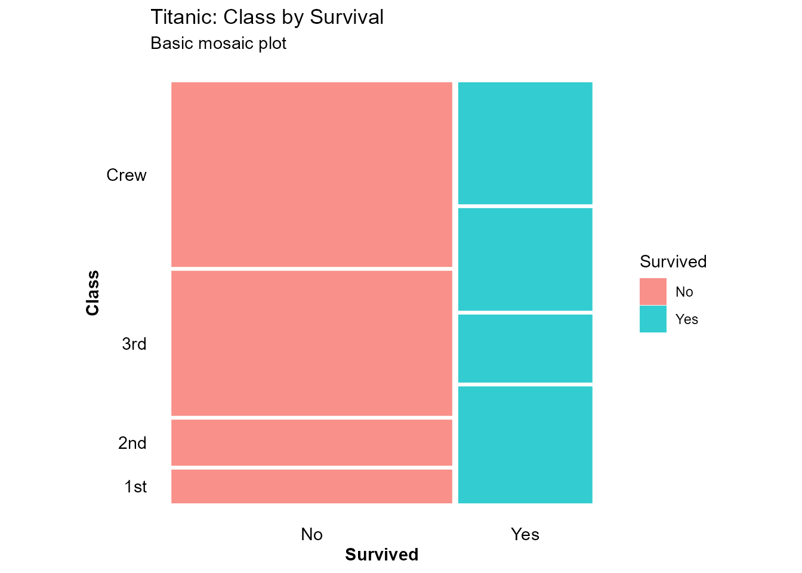

This shows the observed patterns, but we can’t immediately see which
differences are statistically meaningful.

### Extended Mosaic Plot with Residual Shading

Now let’s add an independence model to see deviations from expected
frequencies:

``` r

print(ggplot(data = titanic, aes(x = product(Class, Survived))) +
  geom_mosaic(expected = "independence") +
  scale_fill_residual() +
  labs(title = "Titanic: Class by Survival",
       subtitle = "Independence model with residual shading") +
  theme_mosaic())
```

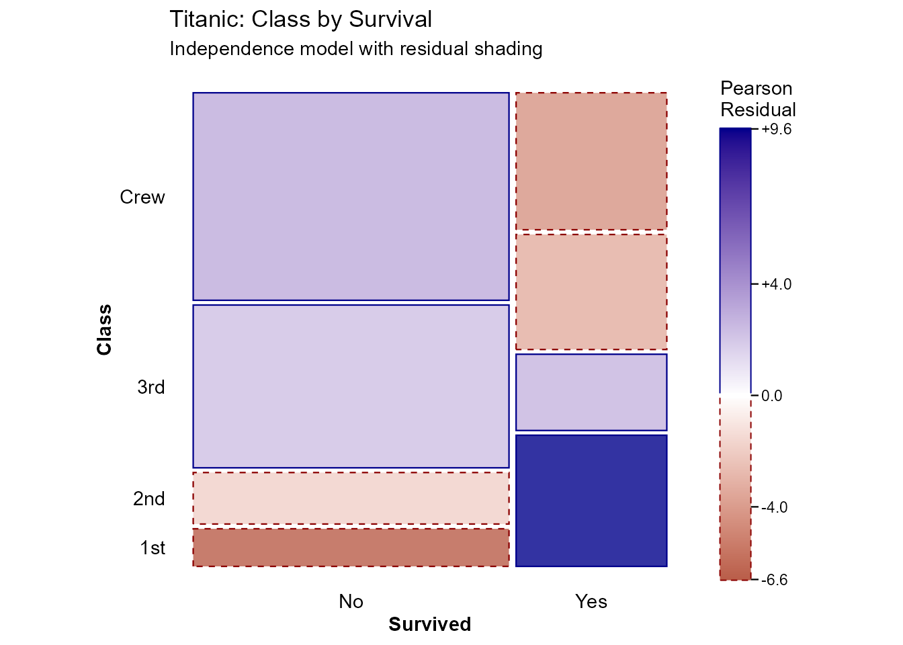

The blue and red shading immediately reveals the pattern: First class
passengers had higher survival rates than expected (blue), while crew
and third class had lower rates (red).

## Model Specification

The `expected` parameter accepts three types of input:

### 1. Shortcut Strings

Three convenient shortcuts for common models:

- **`"independence"`** - Complete independence (main effects only)
- **`"saturated"`** - Saturated model (all interactions, no residuals)
- **`"conditional"`** - Conditional independence given conditioning
  variables

``` r

# Independence model
p1 <- ggplot(data = titanic, aes(x = product(Class, Sex))) +
  geom_mosaic(expected = "independence") +
  scale_fill_residual() +
  labs(title = "Independence Model",
       subtitle = "~ Class + Sex") +
  theme_mosaic()

# Saturated model (no residuals - perfect fit)
p2 <- ggplot(data = titanic, aes(x = product(Class, Sex))) +
  geom_mosaic(expected = "saturated") +
  scale_fill_residual() +
  labs(title = "Saturated Model",
       subtitle = "~ Class * Sex") +
  theme_mosaic()

print(p1)
```

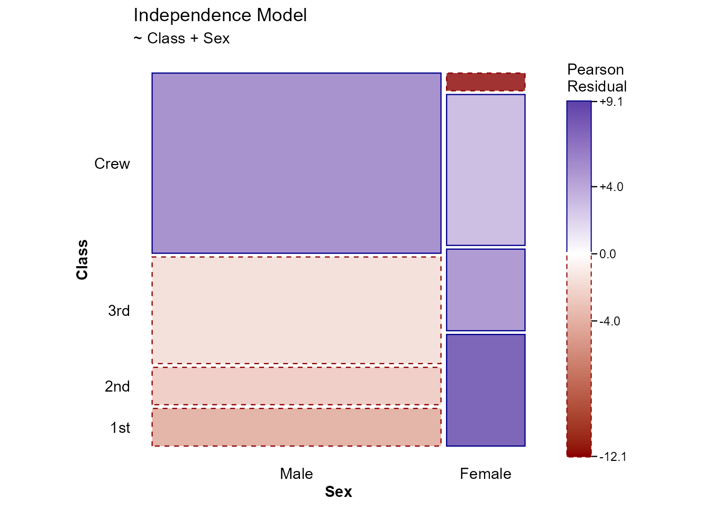

``` r

print(p2)
```

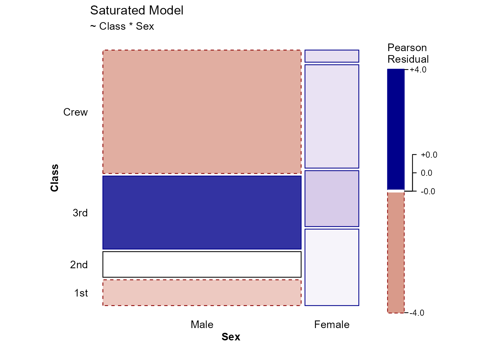

Note that the saturated model shows no shading because it perfectly fits
the data (all residuals = 0).

### 2. Custom Formulas

You can specify custom loglinear models using R’s formula syntax:

``` r

# Model with Class + Sex main effects only (no interaction)
print(ggplot(data = titanic, aes(x = product(Class, Sex, Survived))) +
  geom_mosaic(expected = ~ Class + Sex) +
  scale_fill_residual() +
  labs(title = "Custom Model: Class + Sex",
       subtitle = "Testing for Survival associations given Class and Sex") +
  theme_mosaic())
```

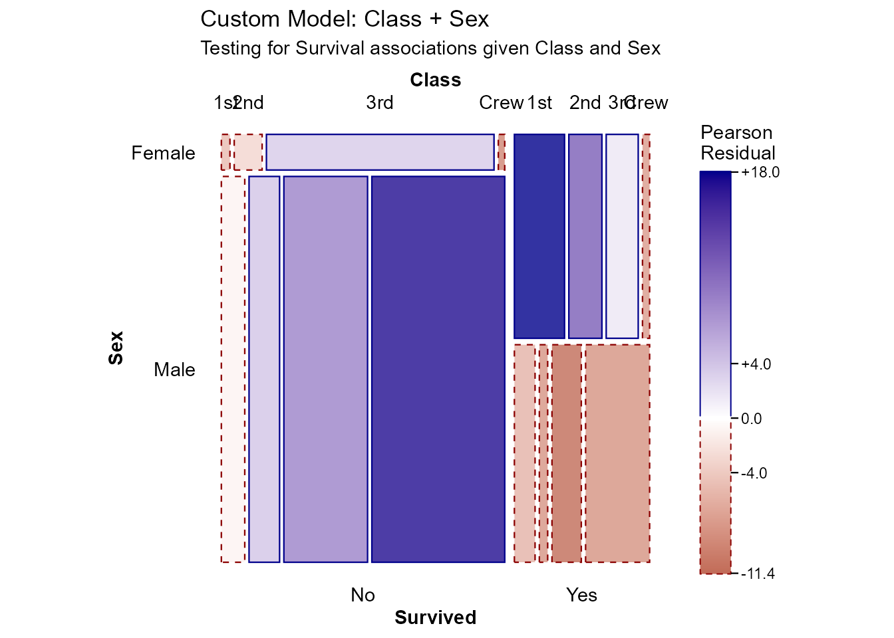

This model asks: “Are there deviations from what we’d expect if Survival
were independent of the Class × Sex combinations?”

### 3. Conditional Independence

When using conditioning variables with `conds`, the `"conditional"`
shortcut is particularly useful:

``` r

# Conditional independence: Health and Marital Status given Sex
ggplot(data = happy,
       aes(x = product(health, marital), conds = sex)) +
  geom_mosaic(expected = "conditional") +
  scale_fill_residual() +
  labs(title = "Health × Marital | Sex") +
  theme_mosaic()
```

## Interpreting Residuals

### What Do Residuals Mean?

Pearson residuals follow approximately a standard normal distribution:

- **\|r\| \< 2**: Not significantly different from expected (white/light
  shading)
- **\|r\| \> 2**: Significantly different at α ≈ 0.05 (moderate
  blue/red)
- **\|r\| \> 4**: Highly significant (dark blue/red)

### Three-Way Tables

Extended mosaic plots are particularly powerful for three-way and higher
tables:

``` r

print(ggplot(data = titanic, aes(x = product(Class, Sex, Survived))) +
  geom_mosaic(expected = "independence") +
  scale_fill_residual() +
  labs(title = "Titanic: Complete Independence Model",
       subtitle = "Class, Sex, and Survival all independent") +
  theme_mosaic())
```

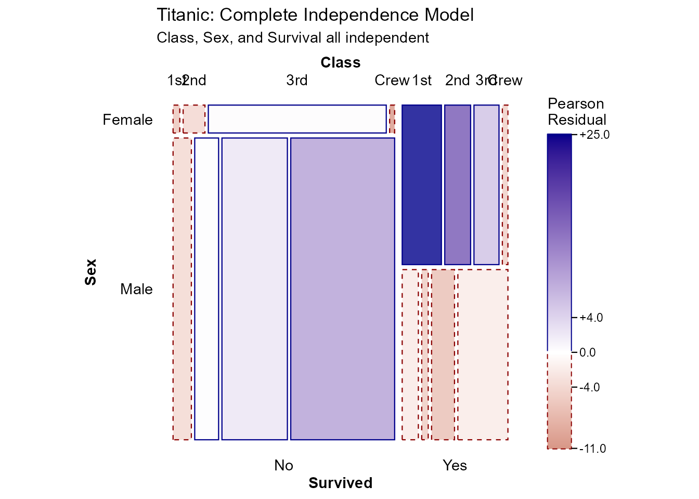

The residuals reveal complex patterns: - First class females had much
higher survival (strong blue) - Crew males had lower survival (red) -
The independence assumption is clearly violated

## Labeling Cells with Values

To make residuals more interpretable, you can display the actual values
in cells using
[`geom_mosaic_text()`](https://friendly.github.io/ggmosaic2/reference/geom_mosaic_text.md):

### Display Observed Counts

``` r

print(ggplot(data = titanic, aes(x = product(Class, Sex))) +
  geom_mosaic(aes(fill = Survived)) +
  geom_mosaic_text(display_values = "observed",
                   format_digits = 0,
                   size = 3) +
  labs(title = "Observed Frequencies") +
  theme_mosaic())
```

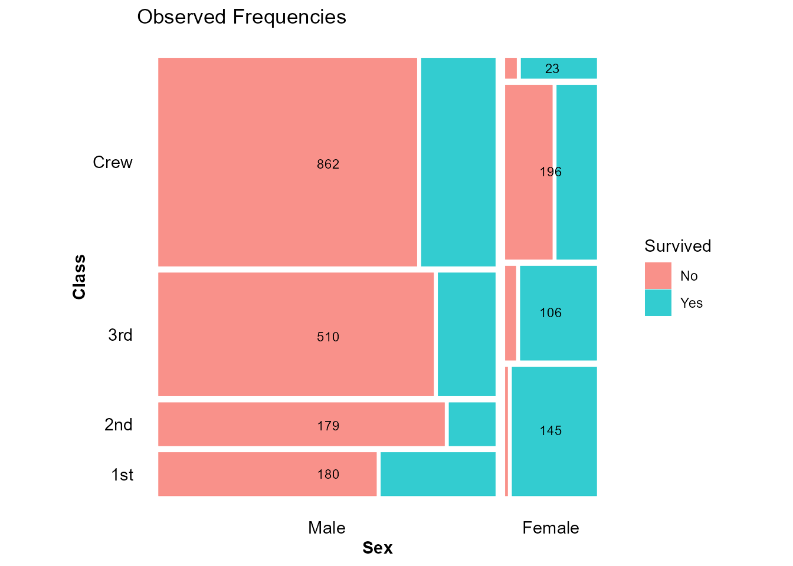

### Display Residuals

When using residual shading, it’s helpful to show the actual residual
values:

``` r

print(ggplot(data = titanic, aes(x = product(Class, Sex))) +
  geom_mosaic(expected = "independence") +
  scale_fill_residual() +
  geom_mosaic_text(expected = "independence",  # Must match geom_mosaic()
                   display_values = "residual",
                   format_digits = 2,
                   colour = "black",
                   size = 3) +
  labs(title = "Residuals from Independence",
       subtitle = "Values show Pearson residuals") +
  theme_mosaic())
```

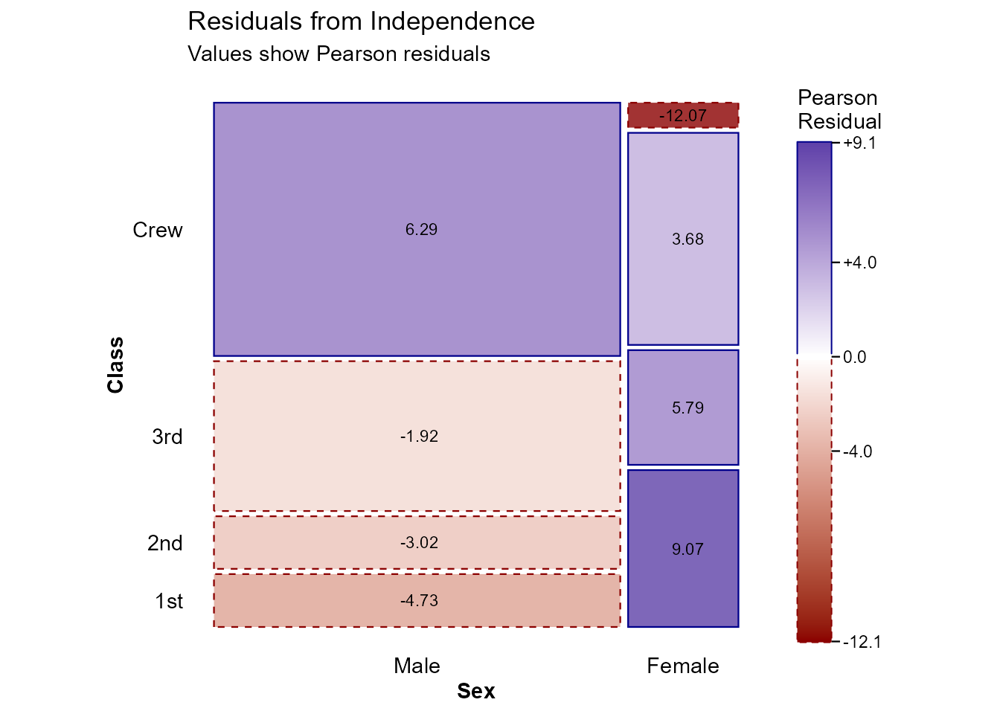

**Important**: When using `display_values = "residual"` or `"expected"`,
you must specify the same `expected` parameter in both
[`geom_mosaic()`](https://friendly.github.io/ggmosaic2/reference/geom_mosaic.md)
and
[`geom_mosaic_text()`](https://friendly.github.io/ggmosaic2/reference/geom_mosaic_text.md).

### Display Expected Frequencies

You can also show what the model expects:

``` r

print(ggplot(data = titanic, aes(x = product(Class, Survived))) +
  geom_mosaic(expected = "independence") +
  scale_fill_residual() +
  geom_mosaic_text(expected = "independence",
                   display_values = "expected",
                   format_digits = 1,
                   colour = "black",
                   size = 3.5) +
  labs(title = "Expected Frequencies Under Independence") +
  theme_mosaic())
```


### The Four Display Options

The `display_values` parameter in
[`geom_mosaic_text()`](https://friendly.github.io/ggmosaic2/reference/geom_mosaic_text.md)
accepts:

1.  **`"label"`** (default) - Factor level labels
2.  **`"observed"`** - Observed counts from the data
3.  **`"expected"`** - Expected values from the fitted model
4.  **`"residual"`** - Pearson residuals

## Customizing the Color Scale

The
[`scale_fill_residual()`](https://friendly.github.io/ggmosaic2/reference/scale_fill_residual.md)
function provides a diverging color scale centered at zero. You can
customize it:

``` r

print(ggplot(data = titanic, aes(x = product(Class, Sex))) +
  geom_mosaic(expected = "independence") +
  scale_fill_residual(
    low = "firebrick",
    mid = "white",
    high = "steelblue",
    limits = c(-6, 6),  # Set symmetric limits
    name = "Pearson\nResidual"
  ) +
  geom_mosaic_text(expected = "independence",
                   display_values = "residual",
                   format_digits = 1,
                   size = 3) +
  labs(title = "Custom Color Scale") +
  theme_mosaic())
```

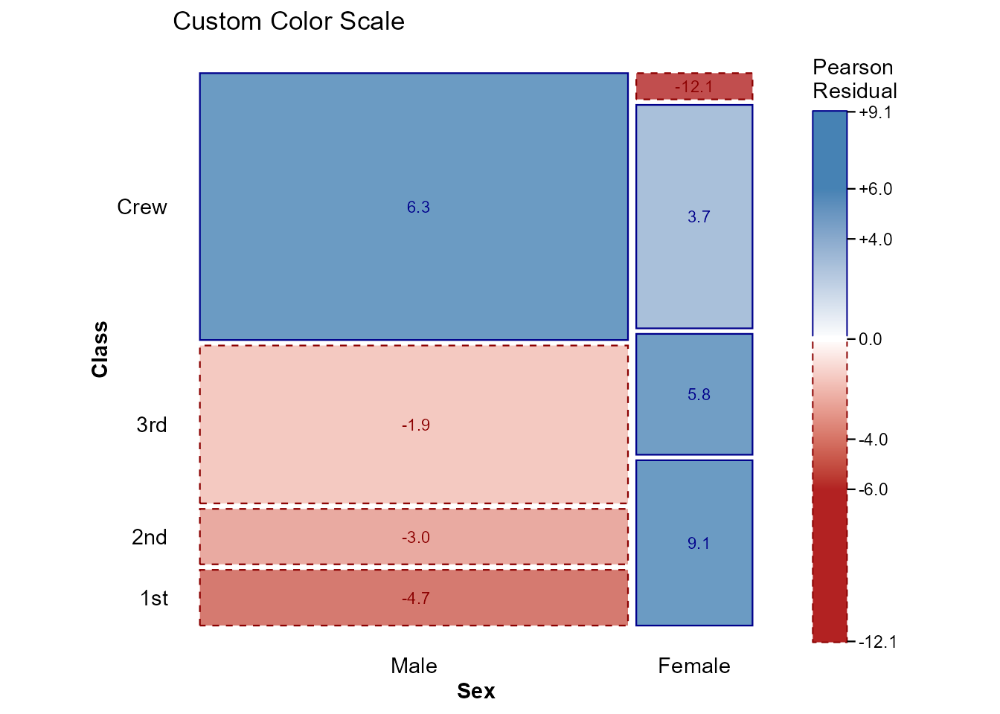

You can also use any ggplot2 diverging scale:

``` r

print(ggplot(data = titanic, aes(x = product(Class, Survived))) +
  geom_mosaic(expected = "independence") +
  scale_fill_gradient2(
    low = "purple",
    mid = "gray95",
    high = "orange",
    midpoint = 0,
    name = "Residual"
  ) +
  labs(title = "Custom ggplot2 Scale") +
  theme_mosaic())
```

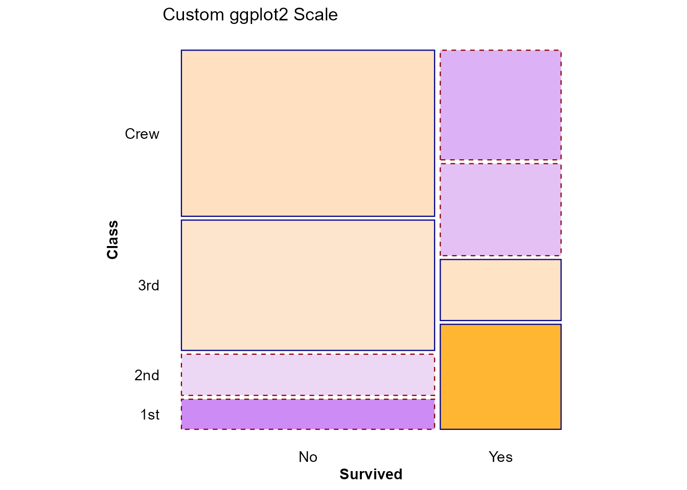

## Text Aesthetics

All standard ggplot2 text aesthetics work with
[`geom_mosaic_text()`](https://friendly.github.io/ggmosaic2/reference/geom_mosaic_text.md):

``` r

print(ggplot(data = titanic, aes(x = product(Class, Survived))) +
  geom_mosaic(expected = "independence") +
  scale_fill_residual() +
  geom_mosaic_text(expected = "independence",
                   display_values = "residual",
                   format_digits = 2,
                   size = 4,           # Text size
                   colour = "white",   # Text color
                   fontface = "bold",  # Font weight
                   family = "serif") + # Font family
  labs(title = "Custom Text Aesthetics") +
  theme_mosaic())
```

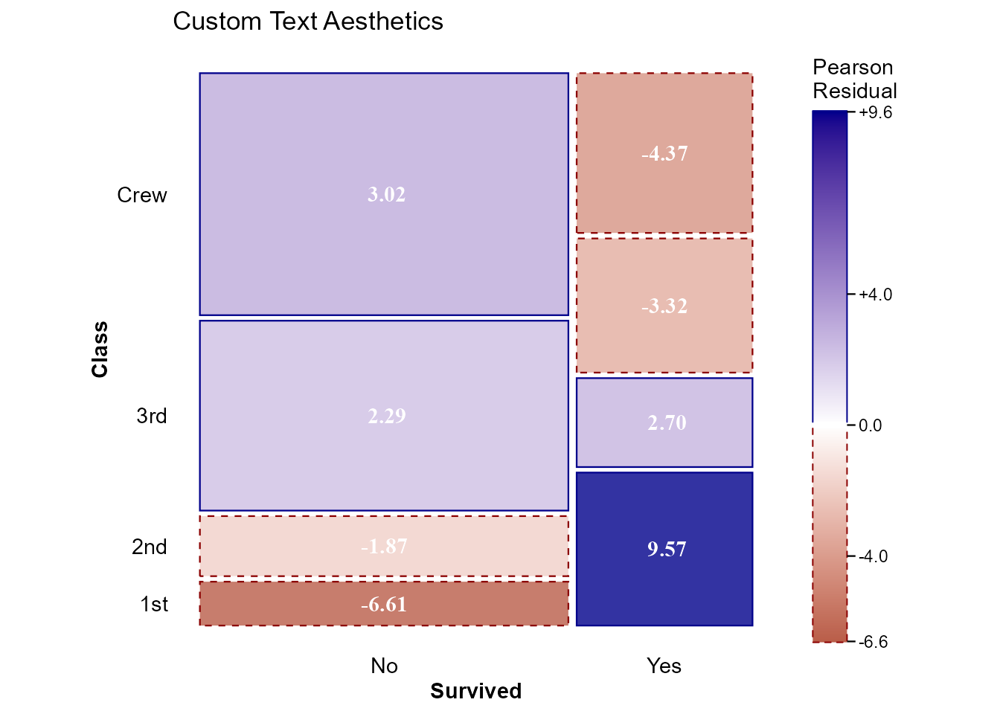

Available text parameters: - `size` (default: 2.7) - `colour`/`color` -
`fontface`: “plain”, “bold”, “italic”, “bold.italic” - `family`: Font
family name - `angle`: Rotation angle in degrees - `hjust`, `vjust`:
Justification (0-1) - `lineheight`: For multi-line text

## Complete Example: Comparing Models

Let’s compare three different models for the same data:

``` r

# 1. Independence of all three variables
p1 <- ggplot(data = titanic, aes(x = product(Class, Sex, Survived))) +
  geom_mosaic(expected = "independence") +
  scale_fill_residual(limits = c(-10, 10)) +
  geom_mosaic_text(expected = "independence",
                   display_values = "residual",
                   format_digits = 1,
                   size = 2.5) +
  labs(title = "Complete Independence",
       subtitle = "~ Class + Sex + Survived") +
  theme_mosaic()

# 2. Survival independent of Class and Sex jointly
p2 <- ggplot(data = titanic, aes(x = product(Class, Sex, Survived))) +
  geom_mosaic(expected = ~ Class + Sex) +
  scale_fill_residual(limits = c(-10, 10)) +
  geom_mosaic_text(expected = ~ Class + Sex,
                   display_values = "residual",
                   format_digits = 1,
                   size = 2.5) +
  labs(title = "Survival Independent of Class × Sex",
       subtitle = "~ Class + Sex (no Survived interaction)") +
  theme_mosaic()

# 3. Class and Sex independent, both related to Survival
p3 <- ggplot(data = titanic, aes(x = product(Class, Sex, Survived))) +
  geom_mosaic(expected = ~ Class + Sex + Survived + Class:Survived + Sex:Survived) +
  scale_fill_residual(limits = c(-10, 10)) +
  geom_mosaic_text(expected = ~ Class + Sex + Survived + Class:Survived + Sex:Survived,
                   display_values = "residual",
                   format_digits = 1,
                   size = 2.5) +
  labs(title = "Class ⊥ Sex | Survival",
       subtitle = "~ Class + Sex + Survived + Class:Survived + Sex:Survived") +
  theme_mosaic()

print(p1)
```

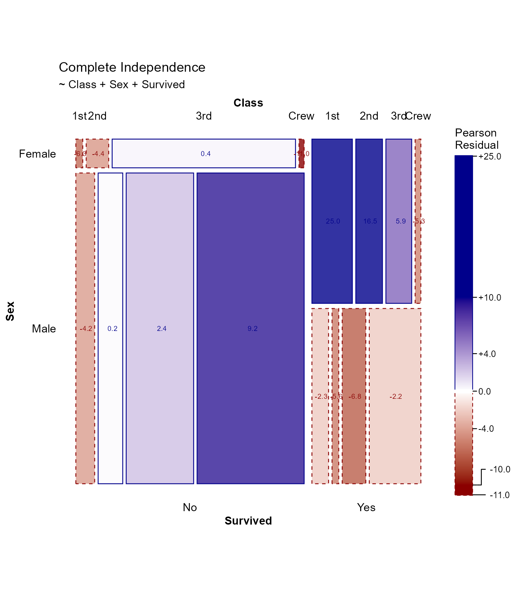

``` r

print(p2)
```

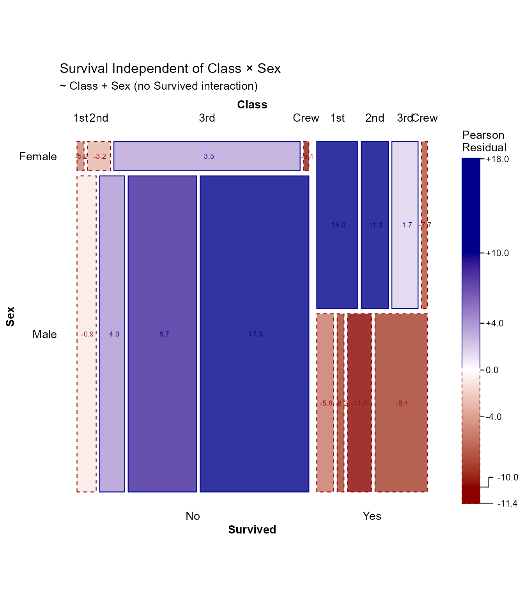

``` r

print(p3)
```

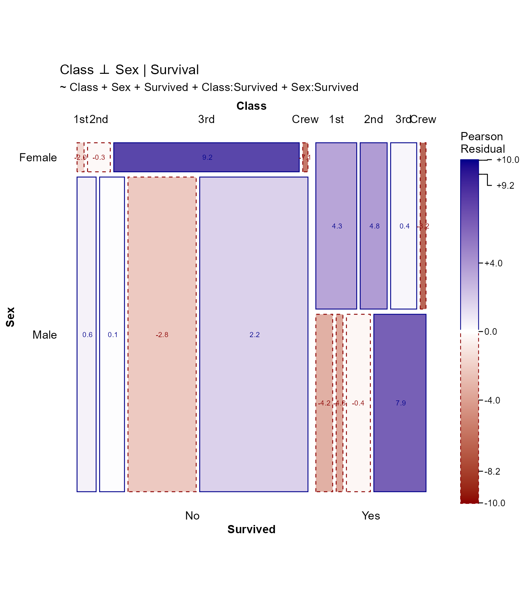

Each model tells a different story about the associations in the data.

## References

- Friendly, M. (1994). “Mosaic Displays for Multi-Way Contingency
  Tables.” *Journal of the American Statistical Association*, 89(425),
  190-200.
- Hartigan, J. A., & Kleiner, B. (1981). “Mosaics for Contingency
  Tables.” *Computer Science and Statistics: Proceedings of the 13th
  Symposium on the Interface*, 268-273.
- Meyer, D., Zeileis, A., & Hornik, K. (2006). “The Strucplot Framework:
  Visualizing Multi-way Contingency Tables with vcd.” *Journal of
  Statistical Software*, 17(3), 1-48.
- Zeileis, A., Meyer, D., & Hornik, K. (2007). “Residual-based Shadings
  for Visualizing (Conditional) Independence.” *Journal of Computational
  and Graphical Statistics*, 16(3), 507-525.

## Session Info

``` r

sessionInfo()
#> R version 4.5.2 (2025-10-31 ucrt)
#> Platform: x86_64-w64-mingw32/x64
#> Running under: Windows 11 x64 (build 22631)
#> 
#> Matrix products: default
#>   LAPACK version 3.12.1
#> 
#> locale:
#> [1] LC_COLLATE=English_Canada.utf8  LC_CTYPE=English_Canada.utf8   
#> [3] LC_MONETARY=English_Canada.utf8 LC_NUMERIC=C                   
#> [5] LC_TIME=English_Canada.utf8    
#> 
#> time zone: America/Toronto
#> tzcode source: internal
#> 
#> attached base packages:
#> [1] stats     graphics  grDevices utils     datasets  methods   base     
#> 
#> other attached packages:
#> [1] dplyr_1.2.1     ggmosaic2_0.5.1 ggplot2_4.0.3  
#> 
#> loaded via a namespace (and not attached):
#>  [1] plotly_4.12.0      sass_0.4.10        generics_0.1.4     tidyr_1.3.2       
#>  [5] productplots_0.1.2 digest_0.6.39      magrittr_2.0.5     evaluate_1.0.5    
#>  [9] grid_4.5.2         RColorBrewer_1.1-3 fastmap_1.2.0      plyr_1.8.9        
#> [13] jsonlite_2.0.0     ggrepel_0.9.8      httr_1.4.8         purrr_1.2.2       
#> [17] viridisLite_0.4.3  scales_1.4.0       lazyeval_0.2.3     textshaping_1.0.5 
#> [21] jquerylib_0.1.4    cli_3.6.6          rlang_1.2.0        withr_3.0.3       
#> [25] cachem_1.1.0       yaml_2.3.12        otel_0.2.0         tools_4.5.2       
#> [29] vctrs_0.7.3        R6_2.6.1           lifecycle_1.0.5    fs_2.1.0          
#> [33] htmlwidgets_1.6.4  ragg_1.5.2         pkgconfig_2.0.3    desc_1.4.3        
#> [37] pkgdown_2.2.0      pillar_1.11.1      bslib_0.11.0       gtable_0.3.6      
#> [41] glue_1.8.1         data.table_1.18.4  Rcpp_1.1.1-1.1     systemfonts_1.3.2 
#> [45] xfun_0.59          tibble_3.3.1       tidyselect_1.2.1   knitr_1.51        
#> [49] dichromat_2.0-0.1  farver_2.1.2       htmltools_0.5.9    rmarkdown_2.31    
#> [53] labeling_0.4.3     compiler_4.5.2     S7_0.2.2
```
