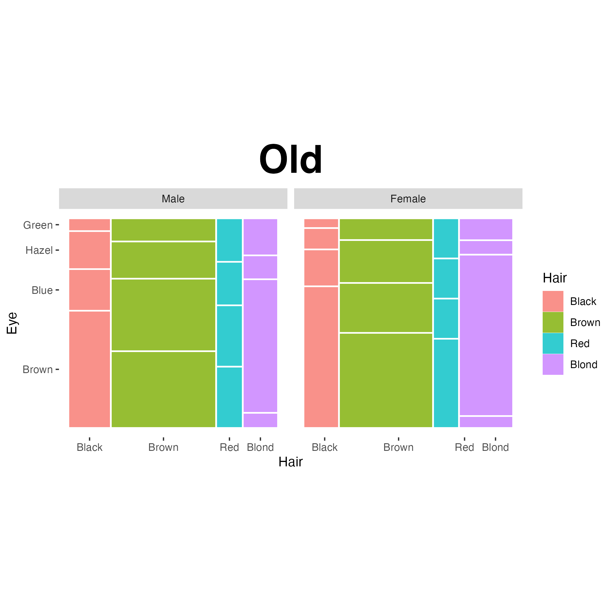

```{r, include = FALSE}
knitr::opts_chunk$set(
  collapse = TRUE,
  message = FALSE,
  warning = FALSE,
  comment = "#>"
)
```

```{r setup}
library(ggmosaic2)
```

With **ggmosaic** being taken off of CRAN and appearing unmaintained (PRs and issues not receiving responses as well as minimal commit activity on the repository), there was a need to bring mosaic plots back to the **ggplot2** framework. In addition to fixing outstanding issues, we (the new authors) also wanted to improve upon the existing package, as several aspects of **ggmosaic**s were inferior and/or limited when compared to mosaics produced by **vcd** and **vcdExtra**.

This vignette describes the many additions and changes made to **ggmosaic** that make up the initial release of **ggmosaic2**. The most important of these changes, is the introduction of _residual shading_, to show the pattern of association in
a frequency table in relation to some loglinear model. This is described in its own vignette  [ggmosaic and Loglinear Models](loglinear-models.html).


## Basic Appearance

A few things were done to alter the basic appearance of mosaics, both with and without the use of `theme_mosaic()`:

### Utilizing the top and right axes

When three or more variables are used, the top (three or more variables) and right (four or more variables) axes will now be utilized. The figures compare the historical `haleyjeppson/ggmosaic` output (**Old**) with `friendly/ggmosaic2` (**New**); 

The current **ggmosaic2** syntax below declares its aesthetics globally:

```{r topright-code, eval=FALSE}
HairEyeColor |>
  as.data.frame() |>
  ggplot(aes(x = product(Sex, Eye, Hair), fill = Hair, weight = Freq)) +
    geom_mosaic()
```

```{r topright-display, out.width='47%', fig.show='hold', echo=FALSE}
knitr::include_graphics(c(
  "fig/topright-old.png",
  "fig/topright-new.png"
))
```

### `theme_mosaic()`

As with other `ggplot2` extensions, themes set the general look-and-feel of the plot such as the color of the background, gridlines, the size and color of fonts. `theme_mosaic()` provides access to the regular ggplot2 theme, but: removes any background, axes ticks, most of the gridlines, and ensures an aspect ratio of 1 for better viewing of the mosaics. This theme also applies a **bold** face to axes labels and allows for the convenient rotation of category labels to avoid overlap.

With `theme_mosaic()` applied to the above:

```{r theme-code, eval=FALSE}
HairEyeColor |>
  as.data.frame() |>
  ggplot(aes(x = product(Sex, Eye, Hair), fill = Hair, weight = Freq)) +
    geom_mosaic() +
    theme_mosaic(base_size = 12)
```

<!-- TODO: Replace the separately generated figures with one composed using patchwork or gridExtra. Already in  Suggests, either would work) -->

```{r theme-display, out.width='47%', fig.show='hold', echo=FALSE}
knitr::include_graphics(c(
  "fig/theme-old.png",
  "fig/theme-new.png"
))
```

Axis labels had a bold face applied to be consistent with mosaics made using **vcd** and **vcdExtra**. Axis ticks were removed, as they are unnecessary for mosaic displays.

New to `theme_mosaic()` is a convenience argument `rot_labels` that can rotate category labels to a user-specified angle (in degrees):

```{r rot-labels, fig.width=9, fig.height=7, dpi=300, fig.align='center', out.width='86%'}
HairEyeColor |>
  as.data.frame() |>
  ggplot(aes(x = product(Sex, Eye, Hair), fill = Hair, weight = Freq)) +
    geom_mosaic() +
    theme_mosaic(rot_labels = 30, base_size = 14)
```

### Spacing of cells

You might already have noticed that the innermost spacing of cells in mosaic displays has been increased in **ggmosaic2**. This is a perceptual feature of mosaic displays [@vcd:Friendly:1994]: wider gaps at the first
splits make it easier and compare to see the frequencies of categories at different dimensions
of the table in the order the mosaic is divided.

Re-using an example from "Utilizing the top and right axes," differentiating between cells is now easier:

```{r reuse-code, eval=FALSE}
HairEyeColor |>
  as.data.frame() |>
  ggplot(aes(x = product(Sex, Eye, Hair), fill = Hair, weight = Freq)) +
    geom_mosaic() +
    theme_mosaic()
```

```{r reuse-display, out.width='47%', fig.show='hold', echo=FALSE}
knitr::include_graphics(c(
  "fig/theme-old.png",
  "fig/theme-new.png"
))
```

In the old **ggmosaic**, increasing the `offset` argument of `geom_mosaic()` would not remedy this issue to a satisfying degree. **ggmosaic2** solves this by implementing a spacing scheme similar to **vcd**:

$$
\text{gap}_j = \text{offset} \times 1.5^{d - j}
$$

where $d$ is the number of splits and $j = 1$ is the innermost split. `offset` remains at a default of `.01`.

## Faceting is Fixed

The old **ggmosaic** had an [issue](https://github.com/haleyjeppson/ggmosaic/issues/78) where facet labels would not be independently generated per panel:

<!-- TODO: Consider whether the old behavior could be useful, i.e, only label Y axis categories in left panel 

        GK: Old behaviour would still be accessible through `facet_grid()` (as opposed to using the new `facet_mosaic_grid()`--though it might be worth seeing if an argument can be created for `facet_mosaic_grid()` to allow for independent generation of x axis category labels while keeping y axis category labels exclusively on the leftmost panels.
-->

```{r facet-old-code, eval=FALSE}
HairEyeColor |>
  as.data.frame() |>
  ggplot(aes(x = product(Eye, Hair), fill = Hair, weight = Freq)) +
  geom_mosaic() +
  theme_mosaic() +
  facet_grid(. ~ Sex)
```

```{r facet-old-display, out.width='80%', fig.align='center', echo=FALSE}

```

The new function `facet_mosaic_grid()` corrects this behavior, generating labels per facet:

```{r facet-new-code, eval=FALSE}
HairEyeColor |>
  as.data.frame() |>
  ggplot(aes(x = product(Eye, Hair), fill = Hair, weight = Freq)) +
  geom_mosaic() +
  theme_mosaic() +
  facet_mosaic_grid(. ~ Sex)
```

```{r facet-new-display, out.width='80%', fig.align='center', echo=FALSE}
knitr::include_graphics("fig/facet-new.png")
```

## Residual-Based Shading

As stated, this portion of the vignette will be covered in minimal detail, with more information found in [ggmosaic and Loglinear Models](loglinear-models.html).

To apply residual-based shading to the `HairEyeColor` example, we will need to supply the `expected` argument of `geom_mosaic()` with a model. Let's use the model of independence. We will also need to use `scale_fill_residual()` instead of the `fill` argument of `geom_mosaic()`:

```{r residual, fig.width=9, fig.height=7, dpi=300, fig.align='center', out.width='86%'}
HairEyeColor |>
  as.data.frame() |>
  ggplot(aes(x = product(Sex, Eye, Hair), weight = Freq)) +
  geom_mosaic(expected = "independence") +
  scale_fill_residual() +
  theme_mosaic(rot_labels = 30)
```

For a shading scheme that accentuates residuals $\geq \pm4$ (similar to the default in **vcd**), you can use the `limits` argument of `scale_fill_residual()`:

```{r residual-limit, fig.width=9, fig.height=7, dpi=300, fig.align='center', out.width='86%'}
HairEyeColor |>
  as.data.frame() |>
  ggplot(aes(x = product(Sex, Eye, Hair), weight = Freq)) +
  geom_mosaic(expected = "independence") +
  scale_fill_residual(limits = c(-4,4)) +
  theme_mosaic(rot_labels = 30)
```

The legend can be re-positioned or disabled through the usual means:

```{r residual-legend-1, fig.width=9, fig.height=7, dpi=300, fig.align='center', out.width='86%'}
HairEyeColor |>
  as.data.frame() |>
  ggplot(aes(x = product(Sex, Eye, Hair), weight = Freq)) +
  geom_mosaic(expected = "independence") + # `show.legend = FALSE` works as well
  scale_fill_residual(limits = c(-4,4)) +
  theme_mosaic(rot_labels = 30, legend.position = "none")
```

```{r residual-legend-2, fig.width=9, fig.height=7, dpi=300, fig.align='center', out.width='86%'}
HairEyeColor |>
  as.data.frame() |>
  ggplot(aes(x = product(Sex, Eye, Hair), weight = Freq)) +
  geom_mosaic(expected = "independence") +
  scale_fill_residual(limits = c(-4,4)) +
  theme_mosaic(rot_labels = 30, legend.position = "bottom")
```

Custom outlines can also be disabled through the usual means:

```{r residual-outlines, fig.width=9, fig.height=7, dpi=300, fig.align='center', out.width='86%'}
HairEyeColor |>
  as.data.frame() |>
  ggplot(aes(x = product(Sex, Eye, Hair), weight = Freq)) +
  geom_mosaic(expected = "independence",
              color = NA) +
  scale_fill_residual(limits = c(-4,4)) +
  theme_mosaic(rot_labels = 30, legend.position = "bottom")
```

## Sharing settings between mosaic layers

When a plot contains multiple mosaic layers (e.g., `geom_mosaic()` and `geom_mosaic_text()`), `mosaic_settings()` can be used to set the `divider`, `offset`, and `expected` arguments once and share them across compatible layers. 

In this example, rather than repeating `expected = "independence"` in each mosaic layer, we specify it once using `mosaic_settings()`:

```{r mosaic-settings, fig.width=9, fig.height=7, dpi=300, fig.align='center', out.width='86%'}
HairEyeColor |>
  as.data.frame() |>
  ggplot(aes(x = product(Sex, Eye, Hair), weight = Freq)) +
  mosaic_settings(expected = "independence") +
  geom_mosaic() +
  geom_mosaic_text(display_values = "residual",
                   format_digits = 1) +
  scale_fill_residual(limits = c(-4,4)) +
  theme_mosaic(rot_labels = 30)
```

<!-- 
GK: We can continue writing here. The below is for the end of the vignette
-->

## Other fixes/changes

- Fixed namespace-only usage ([issue #82](https://github.com/haleyjeppson/ggmosaic/issues/82) from `haleyjeppson/ggmosaic`)
- Allow `theme_mosaic()` to take additional `ggplot2::theme()` arguments through `...`
- Allow for variables created within `geom_mosaic()` aesthetics ([issue #59](https://github.com/haleyjeppson/ggmosaic/issues/59) from `haleyjeppson/ggmosaic`)
  + This change also fixed item (re)ordering ([issue #77](https://github.com/haleyjeppson/ggmosaic/issues/77) from `haleyjeppson/ggmosaic`)
- Fixed fill aesthetic automatically appearing in labels ([issue #39](https://github.com/haleyjeppson/ggmosaic/issues/39) from `haleyjeppson/ggmosaic`)

## References
